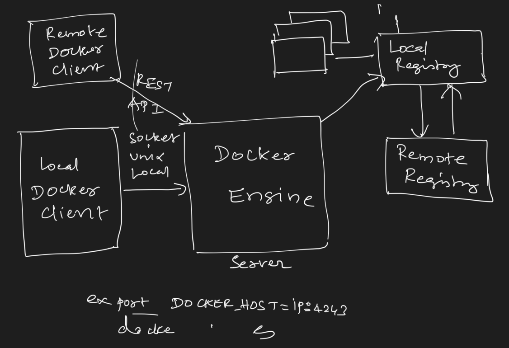

### Docker

• How multi-booting was done a couple of decades ago? 
• What is LILO/GRUB?
• Benefits & drawbacks of multi-ˇbooting using GRUB
• What is Virtualization? 
• What is a Hypervisor?
• Popular Hypervisors
• High-Level Architecture of Hypervisor
• What is Application Virtualization?
• Benefits & drawbacks of Hypervisors
• High-Level Architecture of Docker
• Docker vs Hypervisors
• Understanding Docker Images & Containers 
• Managing Docker Images & Containers 

GRUB will boot the system 
User -> select one and use one OS
At once you can only one OS.. (full resource)
VMware hypervisor  -> Intel  (VT-X) AMD - AMD-V
We need visualisation and software 
Hypervisor - IT revolution  

export DIND_HTTP_PROXY=http://10.19.16.165:8080
export DIND_HTTPS_PROXY=http://10.19.16.165:8080

Client - server 
Unix socket  
Written in go.. 
Json 
File layer 
Everything is json… 
File will be downloaded
Image. - 256 bit ID 
Docker info 
/var/lib/docker 
Repo…
Systemctl start docker 

Mount namespaces: 
Isolates the file to a given directory 
Process namespaces: 
Pid - limits what process can we see.
Net namespaces:
Networking 
Interprocess communication (ipc):
UTS namespaces: 
Timestamp 
UserID namespace:
Ur user 

Docker image inspect “image-name” 
Docker images
Docker ps 
Docker ps -a 
Docker run -it name
Docker inspect containerId
Docker pull hello-world
Docker run hello-world
Docker stop name 
Docker rm name 
Docker rm -f name (for running)
Docker pull nginx
Docker run -d - - name nginx1  - - hostname nginx1  -p 9000(local port):80(docker port) nginx

Volume: 
Docker run -d - - name nginx1  - - hostname nginx1  -v /root/data:/riit/data nginx

FROM ubuntu:16.04
MAINTAINER 
RUN apt update && apt install -y openjdk-8-jre
COPY .jar  /
EXPOSE 8080
ENTRYPOINT [ “java”, “-jar”, “.jar”]

Docker build -t tag . 


