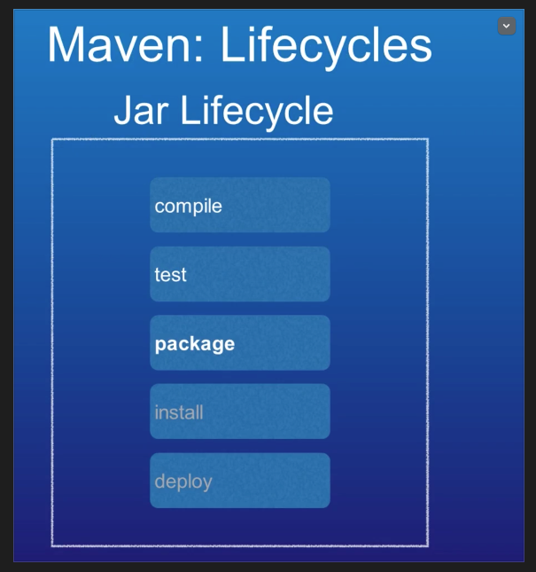

## Maven

### Accumulator of Knowledge

- Ant example 
    - Mkdir src & mkdir data & touch HelloWorld.java
    - Mkdir build/classes => javac -sourcepath src -d build\classes src\data\HelloWorld.java & java -cp build\classes data.HelloWorld
    - Manifest.txt => Main-Class:  data.HelloWorld 
    - jar cfm HelloWorld.jar Manifest.txt HelloWorld.class 
    - Java -jar build/jar/HelloWorld.jar

————————————————
```xml
<project>
    <target name="clean">
        <delete dir="build"/>
    </target>
    <target name="compile">
        <mkdir dir="build/classes"/>
        <javac srcdir="src" destdir="build/classes"/>
    </target>
    <target name="jar"> 
        <mkdir dir="build/jar"/>
        <jar destfile="build/jar/HelloWorld.jar" basedir="build/classes">
            <manifest>
                <attribute name="Main-Class" value=“data.HelloWorld”/>
            </manifest>
        </jar>
    </target>
    <target name="run">
        <java jar="build/jar/HelloWorld.jar" fork="true"/>
    </target>
</project>
```
```xml
<property name="src.dir"     value="src"/>
<property name="build.dir"   value="build"/>
<property name="classes.dir" value="${build.dir}/classes"/>
<target name="run" depends="jar">
    <java fork="true" classname="${main-class}">
        <classpath>
            <path refid="classpath"/>
            <path location="${jar.dir}/${ant.project.name}.jar"/>
        </classpath>
    </java>
</target>
```

——————————————————————

### Maven: Accumulator of Knowledge (Yeddish language)
(Project management tool)
- Build tool for Java & others
- Dependency Management 
- Repository System 
- Plugins 
- Best practices in a software development 
```java
        mvn archetype:generate
        -DgroupId=com.howtodoinjava
        -DartifactId=DemoJavaProject
        -DarchetypeArtifactId=maven-archetype-quickstart
        -DinteractiveMode=false
```

## Maven Phases
Although hardly a comprehensive list, these are the most common default lifecycle phases executed.
* validate: validate the project is correct and all necessary information is available
* compile: compile the source code of the project
* test: test the compiled source code using a suitable unit testing framework. These tests should not require the code be packaged or deployed
* package: take the compiled code and package it in its distributable format, such as a JAR.
* integration-test: process and deploy the package if necessary into an environment where integration tests can be run
* verify: run any checks to verify the package is valid and meets quality criteria
* install: install the package into the local repository, for use as a dependency in other projects locally
* deploy: done in an integration or release environment, copies the final package to the remote repository for sharing with other developers and projects.
There are two other Maven lifecycles of note beyond the default list above. They are
* clean: cleans up artifacts created by prior builds
* site: generates site documentation for this project


### Plugins: 
- Everything
    - More functionality
- Examples 
- Goals 
- Dependencies  

### Convention / Configuration 
- (useful functionality with) Little or no configuration 
- Conventions / Best Practices (default or overridden)
- Standard Directory Template (maven will understand code lies in SRC)
- Override defaults 
- Only if needed 

### Maven build for project is controlled by POM 
- Project Object Model 
- XML document included with Project 
- Pom.xml 

### Main Groups (Building Goals of Maven):  
- Goals (get a job while studying)
- Phases (teenage)
- Lifecycles (get a car)

### Goals:
- Plugin + goal name 
- Example: compile goal on Complier plugin 

### Phases: 
- Maps One or many goals 
    - Part of Greater Lifecycle 
- Compile maps to complier:goal

### Maven LifeCycle: 
- If we call the package phases, compile and test will be done.




- Lifecycles contain Phases 
- Phases map to Goals 
- Many lifecycle 
- Based on maven project 
- Enterprise Application vs Simple Jar 

Maven will look for 	certain project files in specific location known as Standard Directory Template 

- For example, for standard Java projects that produce a Jar file,
       Maven will look in the main Java source code in "src/main/java"
       Maven will look in the main Test source code in "src/main/test”
       Any resources or property, Maven will look for “src/main/resources” 
      Webpage, Maven will look for “src/main/webapp” 
- Not only for Java, Groovy, “src/main/groovy” 
- Need different Locations? 
    - Override in POM 

## POM: 
- Project metadata (name and stuff)
- Maven Coordinates (how maven finds the components of the project by the combination of Group,Name & Version number) 
- Dependencies (are declared, it is referenced by Coordinates) 
- Build Settings( what java version the project must be using, final name of the artifact generate) 
- Supports inheritance (sort of) 
- SUPER POM All projects 
- Convention over configuration 

## Advantage: 
- Automatically Resolve Dependencies 
- Transitive Dependencies (download the other required dependencies)
- Maven Repositories (like nodejs)
- Local Repository (Local Dependency cache) 
- Scope (when it is needed testing or scope)

Maven clean will clean the Target folder 


Mvn package will give the jar file

For clean package -> target will be deleted and package will be created for JAR lifecycle 

Show the local repository in ~/.m2/repository

## Plugins: 
- Critical Part of Maven
- Default/ Core functionality 
- Additional Functionality 
- Maven = Plugin Engine 
    - Plugins implement functionality 
    - Add more goals 
- Plugins are dependencies
    - Downloaded from repos

## Common Plugins: 
- Complie source code 
- Run unit tests 
- Publish to artefact repo 
- Deploy to remote server 
- Publish doc.

## Maven comes with basic set: 
- Common/Core 
    - Known for maven 
    - Downloaded upon reference
- Others: 
    - Mentioned in project in POM
- Change plugin behaviour 
    - Specify in POM configuration.

## Six Scopes: 
- Only 4  commonly are used 
- Scopes
- Compile Scope (default, compilation and execution, Added to dependency project, Included in Containers(WAR/EAR)
- Runtime scope(deployment/Runtime, not required for compilation, Included in container)
- Test scope (testing only, Not needed(compilation, development/run time))
- Provided Scope (Provided by Target (web app, app server)) 
- System scope.(local dependencies (lib folder)) (not recommended (use third party security lib which is not exposed) 
- Import scope (rarely used) 

Most common: Compile, Runtime 
Occasionally: test, Provided 

## Archetypes: 
- Project templates 
- Simple JAR


## POM file: 
- Model Version = Maven version 
- GroupId = identifier of organisation (who owns the project) 
- ArtifactId = final build artifact => Main application lies in 
- Packing = built to JAR file
- Name, Description = documentation  
